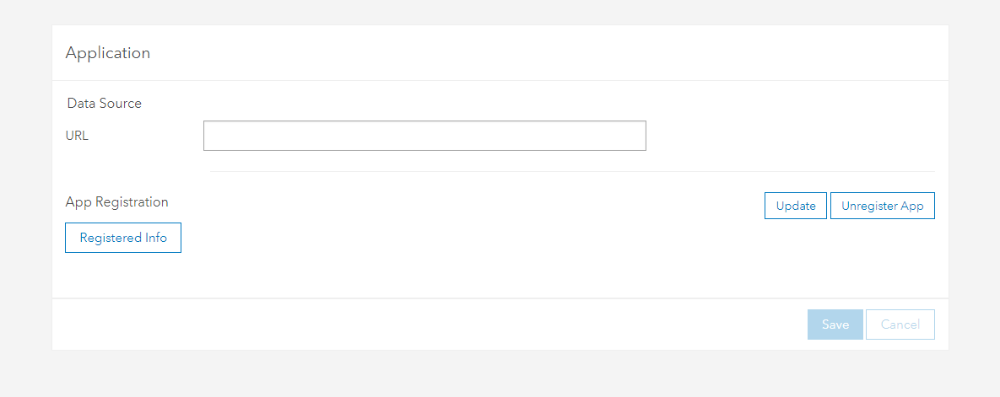

# Bus Stop Install

The purpose of this application is to inspect past inspections. The way that it works is it sends out requests for a particular stop id. It checks the Stops and Ghost stops file on the open data store. Brings back all of the matches and displays them on the first panel. When you click on the panel all of the entries in the bus stop manager main feature service returns. When you click on one of those it then shows the results of that survey and you can open up a read-only version of the survey for inspection.

## search() is where the requests are made

- [Install Survey Results Bus Stop Manager](https://maps.metrostlouis.org/arcgis/home/item.html?id=61074008b9bb40e99f31eaf5da5bcc11) (REACT_APP_ID and REACT_APP_REDIRECT_URI env variable locations)
- [Survey](https://maps.metrostlouis.org/arcgis/home/item.html?id=ad1421bb1d224e129752bba181588dc9) (Location of Install survey)
- Portal = https://maps.metrostlouis.org/arcgis

## Update URI
When you go to host this on a hosted website you will need to update the uri on the [Application Information](https://maps.metrostlouis.org/arcgis/home/item.html?id=9640284533ff41cea8ab9477bca157af) by going to settings and click update to update the uri appliction. You will want to add in the location in where it is hosted. You need to do this so you can connect the authorization system.

## ArcGIS Security and authentication

[Serverless web app workflow
](https://developers.arcgis.com/documentation/security-and-authentication/oauth-2.0/serverless-web-apps/)

# React App Documentation

This project was bootstrapped with [Create React App](https://github.com/facebook/create-react-app).

## Software Requirements

install npm and node => [https://www.npmjs.com/get-npm](https://www.npmjs.com/get-npm)

### Setup on new machine

### `npm install` => installs all the npm libraries in the development folder

In the project directory, you can run:

### `npm start` => ***Starts the App***

Runs the app in the development mode.\
Open [http://localhost:3000](http://localhost:3000) to view it in the browser.

The page will reload if you make edits.\
You will also see any lint errors in the console.

### `npm run build` => ***Builds the application***

Builds the app for production to the `build` folder.\
It correctly bundles React in production mode and optimizes the build for the best performance.

The build is minified and the filenames include the hashes.\
Your app is ready to be deployed!

See the section about [deployment](https://facebook.github.io/create-react-app/docs/deployment) for more information.

### Deployment

This section has moved here: [https://facebook.github.io/create-react-app/docs/deployment](https://facebook.github.io/create-react-app/docs/deployment)
